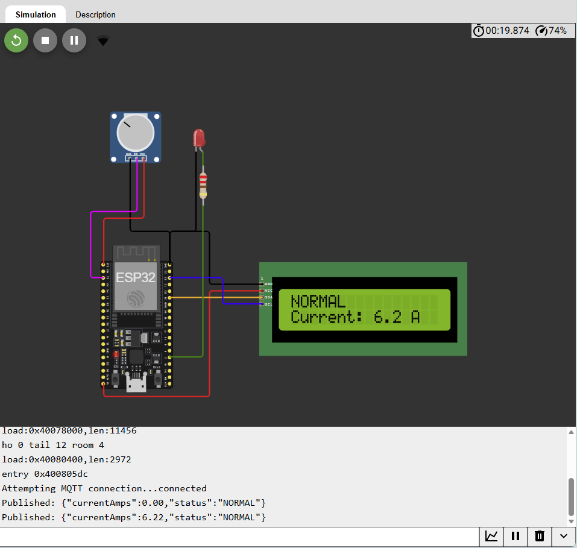
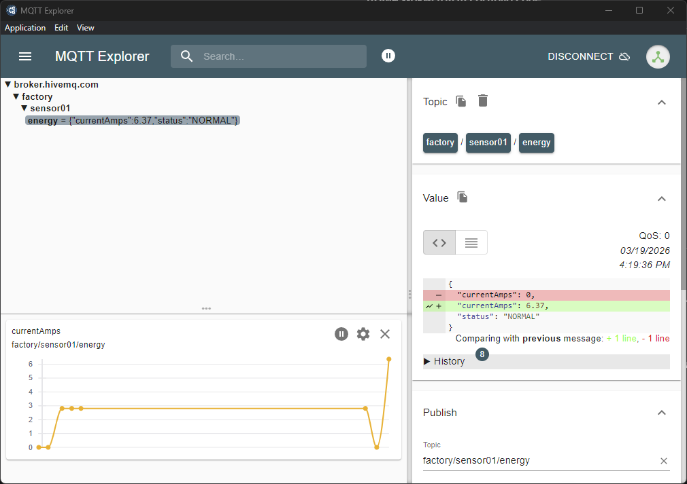

# IoT Smart Energy Monitoring System (ESP32)

An intelligent energy monitoring system designed for industrial environments. This project features real-time current sensing, edge-based anomaly detection, and cloud integration via MQTT.

## 🚀 Key Features
* **Real-time Monitoring:** Measures electrical current via analog sensors (simulated by Potentiometer).
* **Edge Intelligence:** Instant "OVERLOAD" detection and visual alerting (LED & LCD) processed locally on ESP32 to minimize latency.
* **Cloud Connectivity:** Data is published in JSON format to a Public MQTT Broker (HiveMQ).
* **Live Simulation:** Fully functional simulation available on Wokwi.

## 🛠️ Tech Stack
* **Hardware:** ESP32 (DOIT DevKit V1), I2C LCD 16x2.
* **Communication:** MQTT Protocol (PubSubClient), WiFi.
* **Development:** VS Code + PlatformIO.

## 🕹️ Live Demo

**How to use the demo:**
1. Start the simulation.
2. Rotate the Potentiometer to change current values.
3. Observe the LCD and LED status. (Threshold: > 15.0A for Overload).
4. Monitor real-time data on HiveMQ Web Client (Topic: `factory/sensor01/energy`).

## 🔧 Installation & Setup
1. Clone the repository.
2. Open with VS Code + PlatformIO.
3. Build and Upload to ESP32 or run via Wokwi extension.